# REST_API_Generator
**YOU DO NOT HAVE TO PROGRAM A REST-API ANYMORE! GENERATE IT!**
 
This is a big project that demonstrates my skills in frontend (TypeScript, Angular, HTML, SASS) and
backend development (JavaScript, Node-RED).
It is a useful client-server application that can facilitate backend development by
automatically generating REST-API configurations that can be easily deployed in Node-RED 
(either automatically or manually).
The REST-API generator supports two RDBMS: 
* Microsoft SQL Server
* PostgreSQL

Refer to [the screenshot guide](#screenshot-guide) for more information.

## Used technologies

* **Frontend:** Angular
* **Backend:** Node-RED

## Generator architecture
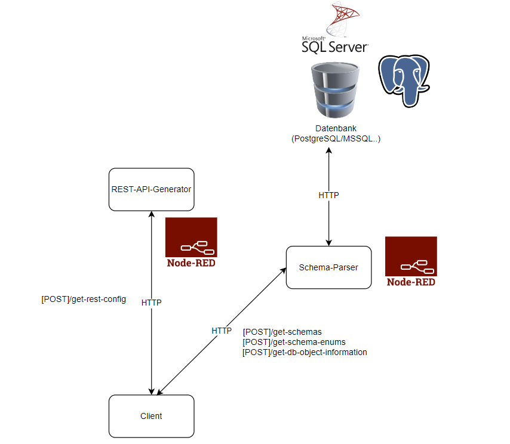

## Screenshot guide
**Step 1:** Open Node-RED in the command line.
 
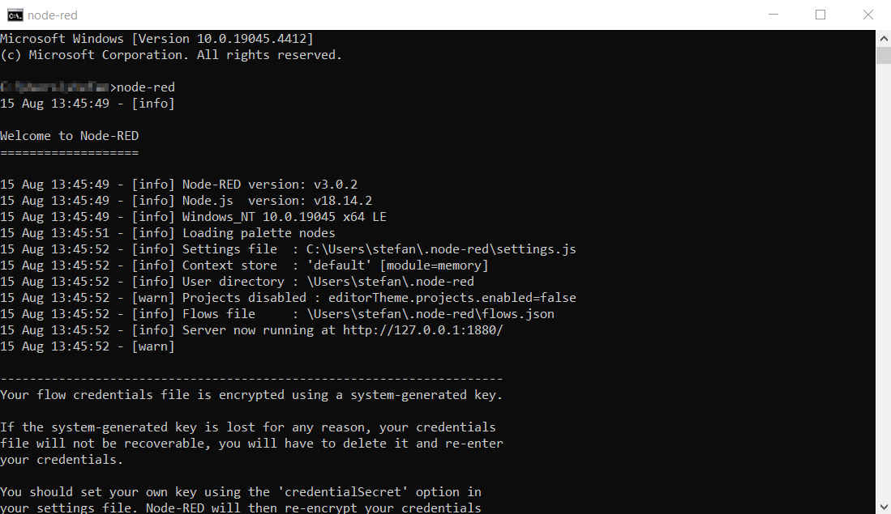
 
**Step 2:** Import the necessary flows that are part of the backend application.
 
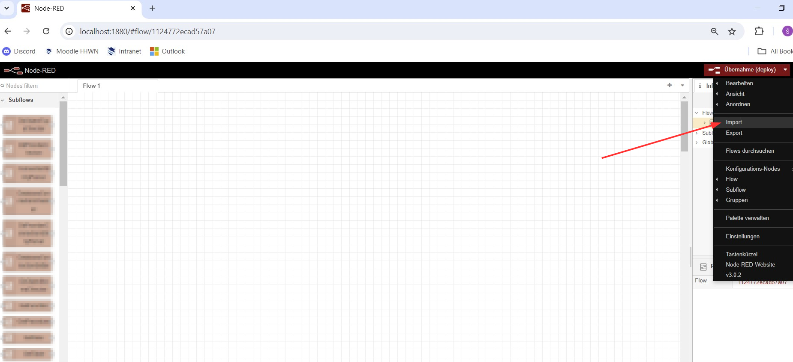
 
**Step 3:** Import the [Schema-Parser](./Node-RED-Flows/Schema_Parser_Flow/schema_parser.json)
and the [REST-API-Generator](./Node-RED-Flows/Config_Generator_Flow/config_generator_service.json).
 
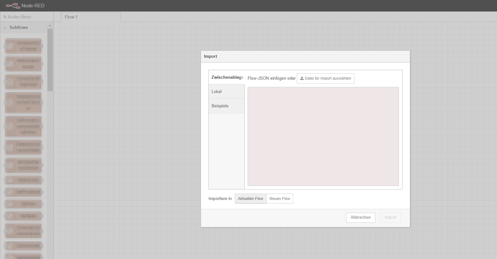
 
**Step 4:** Deploy the both flows (start the backend application).
 
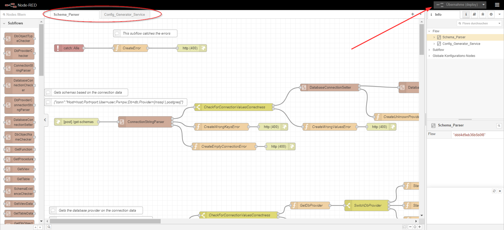
 
**Step 5:** Start the [Angular frontend application](./Frontend/prototype-frontend) using **ng serve** in your
command line. Configure all necessary information [here](./Frontend/prototype-frontend/src/app/configuration).
 
**Step 6:** Enter the database data about the database your REST-API relies upon.
 
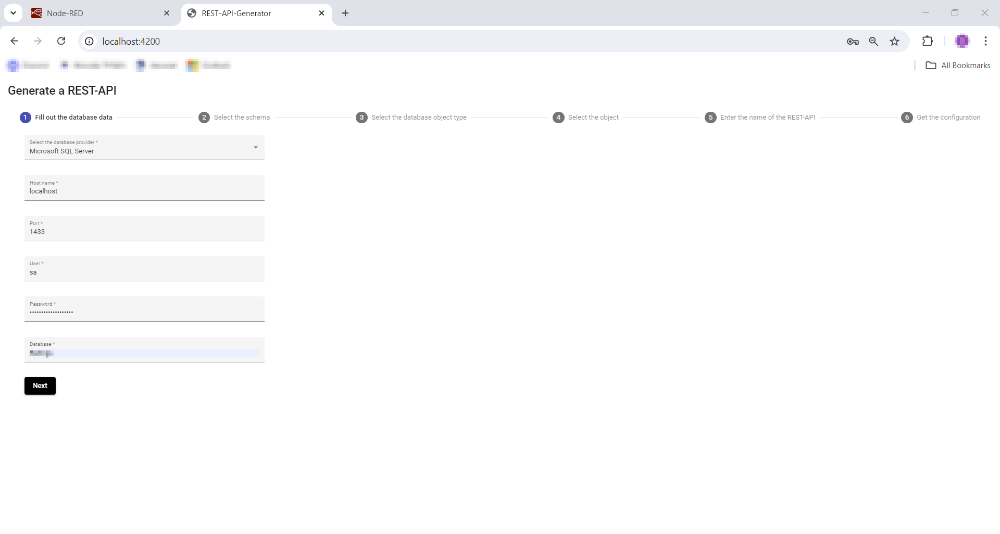
 
**Step 7:** Select the database schema.
 
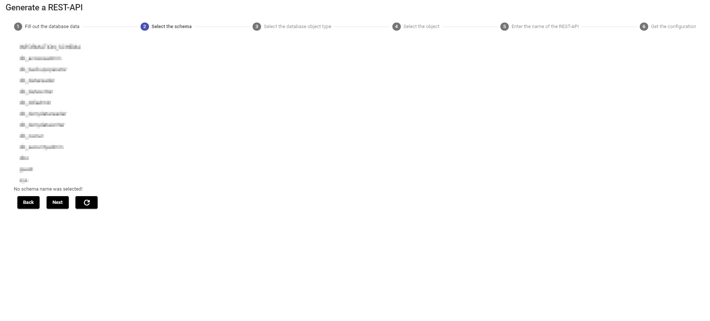
 
**Step 8:** Select the object type (table, view, function or stored procedure).
 
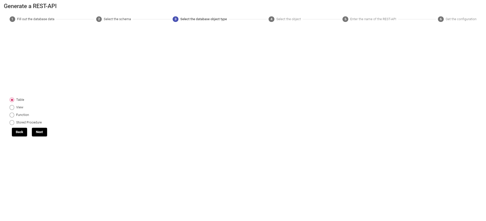
 
**Step 9:** Select the object name.
 
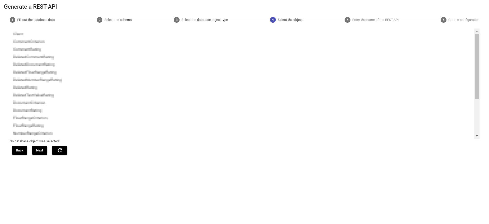
 
**Step 10:** Select the REST-API name (is displayed in the Node-RED tab).
 
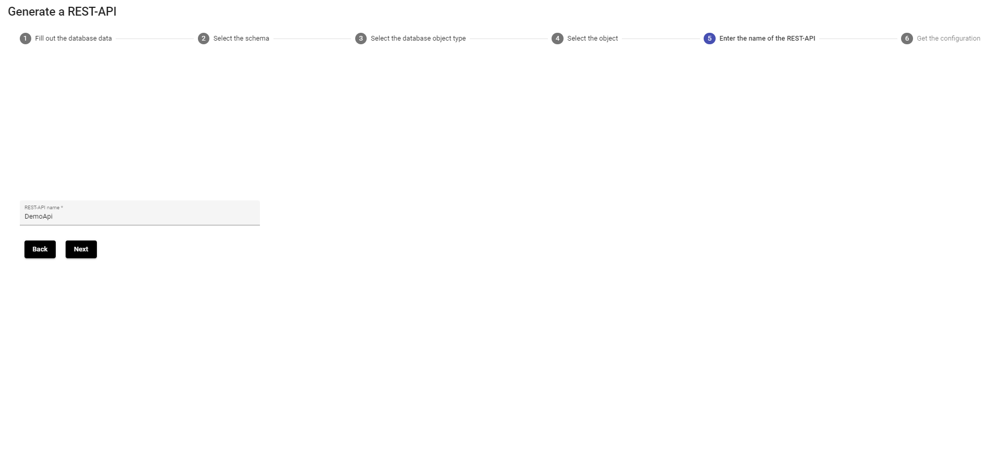
 
**Step 11:** Copy the JSON-configuration of the REST-API flow
 
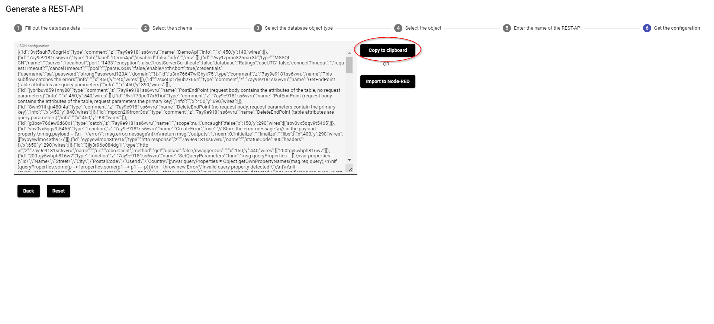
 
and paste in the flow import manually.
 
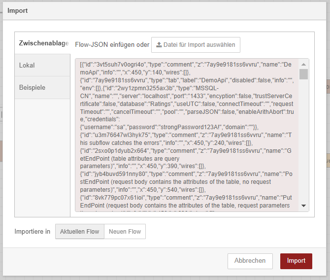
 
Deploy the flow manually.
 
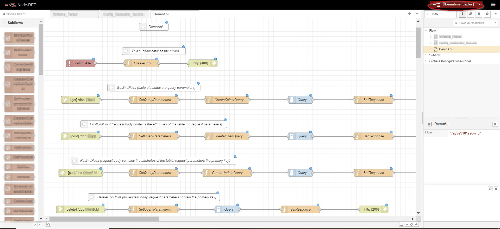
 
**OR**
 
Import the flow automatically.
 
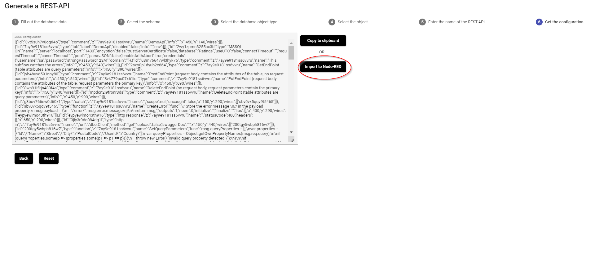
 
Enter the URL of the Node-RED instance where the REST-API should be deployed.
 
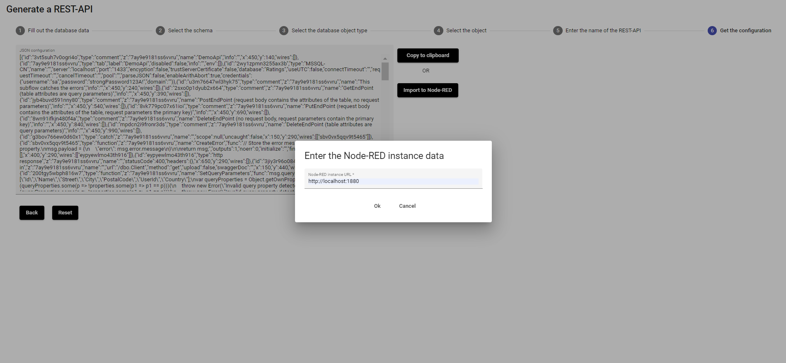
 
You will receive a notification that the flow was succesfully imported and deployed.
 
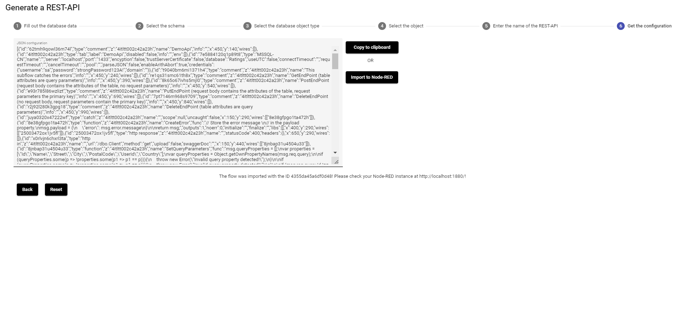
 
As you can see, the flow is deployed automatically.
 
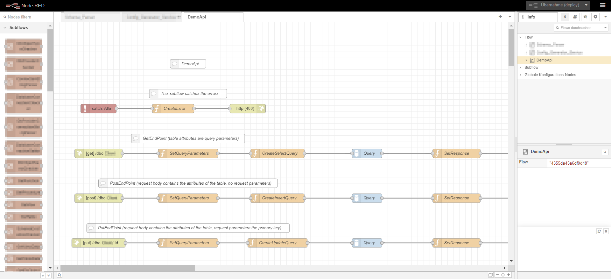
 
**Step 12:** Test the deployed REST-API (tested with Postman). It works!
 
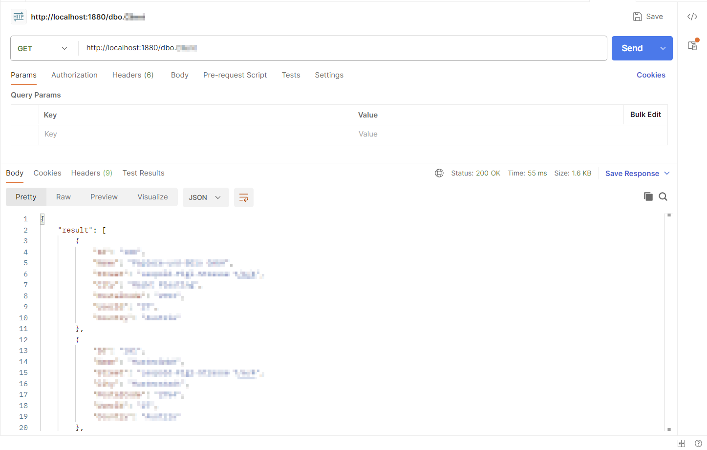